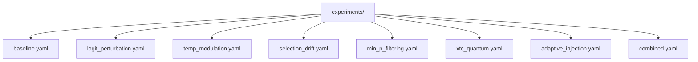

# Experiments and Analysis

This document is for users treating entropick as a research instrument rather than just a runtime integration.

## Experiment presets

The `experiments/` directory contains human-readable presets for common experimental conditions:



These files are not auto-loaded by entropick. They are reproducible environment bundles.

Use them by copying the `env:` block into:

1. a local `.env` file
2. your shell environment before launch
3. request defaults, when a field is safe to override per request

See [`../experiments/README.md`](../experiments/README.md) for the preset directory overview.

## Suggested workflow

1. Start from `baseline.yaml` as the control condition.
2. Change one mechanism at a time.
3. Record the exact env block used for every run.
4. Keep infrastructure settings fixed while comparing sampling behavior.
5. Make fallback behavior explicit rather than leaving it implicit.

## Double-blind controls

The `sham_qrng` entropy source provides `os.urandom()` bytes with configurable simulated latency through `QR_SHAM_QRNG_LATENCY_MS`.

Use it when you need a control condition that is operationally similar to a real hardware source but does not rely on that hardware source.

## Analysis tools

entropick includes analysis helpers for saving token-level records and comparing sessions.

### Persistence

```python
from qr_sampler.analysis import load_records, save_records

save_records(records, "session_001.jsonl")
data = load_records("session_001.jsonl")
```

### Session comparison

```python
from qr_sampler.analysis import compare_sessions, effect_size_report

result = compare_sessions(baseline, experimental, field="u_value")
effect = effect_size_report(baseline, experimental, field="u_value")
```

### Statistical tests

The analysis module includes tests such as:

- autocorrelation
- runs test
- serial correlation
- Hurst exponent
- approximate entropy
- chi-square rank test
- cumulative deviation
- entropy rate
- Bayesian sequential analysis

`scipy` is required for the statistical test helpers.

## Practical interpretation notes

entropick amplifies small entropy-source differences into token-selection differences. That makes it useful for controlled comparisons, but it also means you should be disciplined about:

- fixed prompts and models
- explicit config capture
- sham or baseline controls
- separating infrastructure changes from sampling changes

For the lower-level mechanics behind the amplification and pipeline stages, see [`how-it-works.md`](how-it-works.md).
