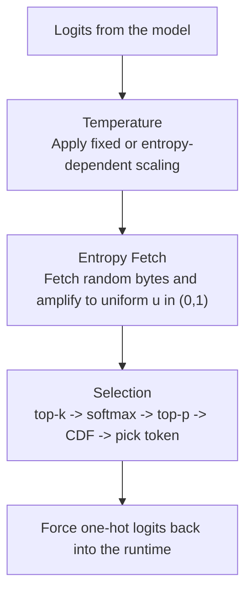
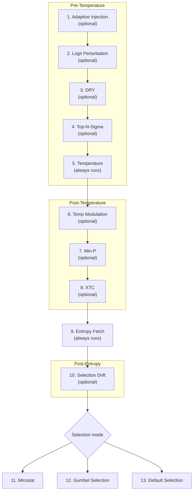

# How It Works

entropick intercepts token selection after logits are computed, fetches entropy at that point, and uses that entropy to drive the final token choice.

## Default path

With default settings, only three stages do real work:



## Full stage pipeline

Stages can be enabled independently. The default path is just the smallest subset.



Stages 11-13 are mutually exclusive. If Mirostat or Gumbel is enabled, the default CDF selector is skipped.

## Stage reference

All stages below are disabled by default unless their control parameters are enabled.

### Logit Perturbation

Adds per-logit Gaussian noise derived from external entropy.

| Parameter | Default | Effect |
|-----------|---------|--------|
| `QR_LOGIT_PERTURBATION_ALPHA` | `0.0` | Noise magnitude |
| `QR_LOGIT_PERTURBATION_SIGMA` | `1.0` | Gaussian std before alpha scaling |

### Temperature Modulation

Modulates temperature per token using external entropy.

| Parameter | Default | Effect |
|-----------|---------|--------|
| `QR_TEMP_MODULATION_BETA` | `0.0` | Modulation magnitude |

### Selection Drift

Maintains a per-request drift position that replaces the amplified `u` value.

| Parameter | Default | Effect |
|-----------|---------|--------|
| `QR_DRIFT_STEP` | `0.0` | Step size |
| `QR_DRIFT_INITIAL_POSITION` | `0.5` | Starting position in `[0, 1)` |

### Min-P

Removes tokens where `p < min_p x max(p)`.

| Parameter | Default | Effect |
|-----------|---------|--------|
| `QR_MIN_P` | `0.0` | Threshold |

### XTC

Probabilistically excludes top tokens using entropy-driven coin flips.

| Parameter | Default | Effect |
|-----------|---------|--------|
| `QR_XTC_PROBABILITY` | `0.0` | Exclusion probability per token |
| `QR_XTC_THRESHOLD` | `0.1` | Minimum probability to become an exclusion candidate |

### Adaptive Injection

Scales injection methods using the Shannon entropy of the current logit distribution.

| Parameter | Default | Effect |
|-----------|---------|--------|
| `QR_ADAPTIVE_INJECTION` | `false` | Enable or disable |
| `QR_ADAPTIVE_INJECTION_LOW_H` | `1.0` | Lower entropy threshold |
| `QR_ADAPTIVE_INJECTION_HIGH_H` | `3.0` | Upper entropy threshold |

### DRY

Penalizes repeated n-gram sequences.

| Parameter | Default | Effect |
|-----------|---------|--------|
| `QR_DRY_MULTIPLIER` | `0.0` | Penalty multiplier |
| `QR_DRY_BASE` | `1.75` | Exponential penalty base |
| `QR_DRY_ALLOWED_LENGTH` | `2` | Minimum sequence length to penalize |
| `QR_DRY_PENALTY_LAST_N` | `-1` | Lookback window |

### Top-N-Sigma

Keeps only tokens whose logits are within N standard deviations of the maximum.

| Parameter | Default | Effect |
|-----------|---------|--------|
| `QR_TOP_N_SIGMA` | `0.0` | Standard deviations |

### Mirostat v2

Adaptive perplexity control.

| Parameter | Default | Effect |
|-----------|---------|--------|
| `QR_MIROSTAT_MODE` | `0` | `0` disabled, `2` = Mirostat v2 |
| `QR_MIROSTAT_TAU` | `5.0` | Target surprise rate |
| `QR_MIROSTAT_ETA` | `0.1` | Learning rate |

### Gumbel-Max Selection

Adds Gumbel noise to log probabilities and selects via argmax.

| Parameter | Default | Effect |
|-----------|---------|--------|
| `QR_GUMBEL_SELECTION` | `false` | Enable Gumbel-Max selection |

## gRPC transport

| Mode | `QR_GRPC_MODE` | Latency | Best for |
|------|----------------|---------|----------|
| Unary | `unary` | ~1-2 ms overhead | Simplicity, debugging |
| Server streaming | `server_streaming` | ~0.5-1 ms | Middle ground |
| Bidirectional | `bidi_streaming` | ~50-100 us on the same machine | Lowest latency |

For co-located hardware, Unix domain sockets are a good default:

```bash
export QR_GRPC_SERVER_ADDRESS=unix:///var/run/qrng.sock
export QR_GRPC_MODE=bidi_streaming
```

### Circuit breaker

The gRPC client includes an adaptive circuit breaker:

- rolling P99 latency window
- adaptive timeout based on observed latency
- open-after-failure threshold
- half-open recovery retry window
- fallback through `QR_FALLBACK_MODE`

These thresholds are controlled by the `QR_CB_*` environment variables.

## Signal amplification

The default amplifier converts raw entropy bytes into a uniform float `u` in `(0, 1)`:

1. interpret bytes as `uint8`
2. compute the sample mean
3. z-score against the configured population mean and std
4. map through the normal CDF
5. clamp away from exact `0` and `1`

Under the null hypothesis, `u` is uniformly distributed. Small per-byte biases can accumulate over many samples, which is why `QR_SAMPLE_COUNT` materially affects sensitivity and latency.

An alternative ECDF amplifier (`QR_SIGNAL_AMPLIFIER_TYPE=ecdf`) uses empirical calibration instead of distributional assumptions.
